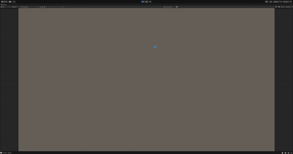

# Tibiscuit
Tibiscuit must survive the pursuit of his wife "nana biscuit" by hiding and managing to find bootle of milk to make him become Cake kong and end this madness.It is  It is a game made for the game jam : "Arcadia jam 6".

it's the story after this : https://www.youtube.com/watch?v=xw2Fd3N5u08

un peu à la metal gear un jeu d'infiltration ou tibiscuit doit s'enfuir/exterminer nana biscuit en vue du dessus ou on pourrait mettre 5 niveau avec un peu de scénario entre chaque niveau.

le gameplay : on bouge au clavier et il y a plusieurs nana biscuit sur la map qui ont des chemins predetermine et il faut eviter le ligne de vue. Le but est d'aller récupérer la bouteille de lait pour devenir Cake Kong et exterminer les nana biscuit. On a 2 mécaniques qui peuvent etre sympa en lien avec le pain d'épices :
* quand il absorde du liquide il devient tout mou ce qui le rend plus léger et malléable = peut passer des barreau
* quand il se sèche à l'aide d'une bouche de ventilation ou autre il devient tout dure ce qui le rend plus solide et plus lourd = peut passer des endroit avec des courants d'air puissant

Le boublage se fait chez les nana biscuit directement sur le terrain en étant un peu creepy du genre "mon chéri montre toi" ou autre + entre les niveaux on peut essayer de faire un dialogue entre tibiscuit et nana biscuitpour faire un semblant d'histoire

# TODO
## Développement
### joueur
* ~~faire bouger le joueur~~
* ~~lui rajouter les mecanisme de gameplay spécifiques~~
    * ~~lui rajouter les etats sec et humide~~
    * ~~faire un changement de parametre en fonction des états~~
    * ~~rajouter les barreaux et les courants d'air~~
### ennemie
* ~~faire bouger un enemies avec un navmesh~~
    * ~~le faire avec plusieurs enemies~~
* ~~mettre un champ de vision visible par le joeur aux enemies~~
* ~~faire que ce champ de vision active la poursuite de nana sur tibi~~
    * le faire pour tous les enemies sur la map
* ~~faire que les enemies ont un chemin prédéfini  et qu'ils le suivent~~
* regarder pour activer/désactiver la poursuite en fonction de la situation
### terrain
* ~~génération du terrain automatique pour pas avoir a chaque fois a changer de scene~~
### UI
* faire un menu (peut etre)
* faire une pause (peut etre)
* faire un game over
* faire un écran de discussion entre les niveaux

### Optionnel

* lors de la génération on peut faire une joli animation montante desceendante
* les 4 premiers niveau on peut les finir par un escalier qui va vers le haut ou un couloir
* dernier niveau le finir par une bouteille de lait

## Graphisme
**Style : Low poly**
**Biome : à voir**
### Environnement
#### Skybox
* a voir
#### Tile
* barriere
* courant d'air
* ventilation
* eau
* mur
#### Personnage
* modele 3D tibiscuit
* animation de course tibiscuit
* modele 3D nana biscuit
* animation de course nana biscuit
#### UI
* ecran game over (armée de nana biscuit dans la maison ref video )
* écran de avec en bas a gauche tibiscuit et en bas a droite nana biscuit
* écran de victoire (cake kong qui détruit les nana biscuit) et victoire alternative (tibiscuit assis sur le canapé avec nana biscuit ref video)
### Autres
* sols
* couloirs

## Sonore

### Doublages
* les enemies génériques nana biscuit
* écran de discussion entre tibiscuit et nana biscuit

### Optionnel

* son pour le courants d'air
* son de marche
* son de marche dans l'eau

# idee

## terrain

* essayer de faire un style pain d'épice / hansel et gretel
* Mettre la caméra en vue isométrique

pour l'instant : 

